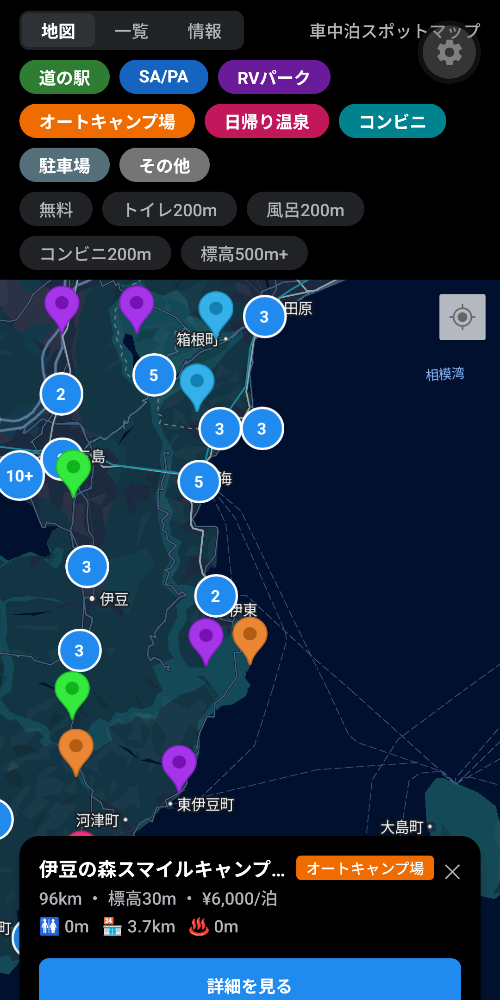
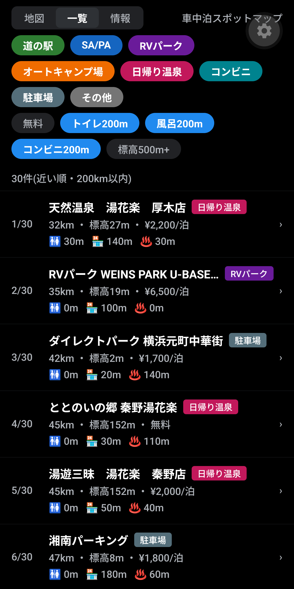
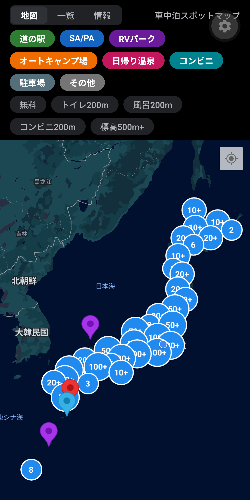

# 車中泊スポットマップ (tns-mobile)

現在地周辺の車中泊スポットを地図・一覧で探し、タップで Web(車旅のしおり)の詳細ページへ誘導する、獲得ファネル用のモバイルアプリです。全国約 1,900 件の車中泊スポットを表示します。

アプリ内に詳細画面は持たず、唯一の成果地点は **Web 誘導**(外部ブラウザで [車旅のしおり](https://tabi.over40web.club) のスポット詳細を開くこと)です。データは車旅のしおりの公開 API(`/api/v1/spots`)から取得します。


## スクリーンショット

<p align="center">
  
  
  
</p>

## 主な機能

- **地図 / 一覧 / 情報** の 3 表示切り替え(地図はマーカーのクラスタリング表示)
- **種別フィルタ** と **クイック絞り込み**(無料・トイレ/風呂/コンビニ 200m 以内・標高 500m 以上、AND 条件)
- **現在地基準**の「近い順」表示。現在地が使えないときは **地図中心基準** に自動で切り替え
- **オフライン対応**: スポットを端末にキャッシュし、再取得に失敗しても表示を継続。一定期間より古い場合は「古いデータ表示」で鮮度を通知
- **車中泊禁止警告**: 泊まれないスポットも隠さず、明示的に区別して表示
- PostHog による匿名の利用計測(未設定なら無効化)

ドメイン用語の定義は [CONTEXT.md](./CONTEXT.md) を参照してください。

## 技術スタック

- [Expo](https://expo.dev) SDK 57 / React Native 0.86 / React 19
- [Expo Router](https://docs.expo.dev/router/introduction)(ファイルベースルーティング、`src/app`)
- [react-native-maps](https://github.com/react-native-maps/react-native-maps)(iOS: Apple Maps / Android: Google Maps。選定理由は [docs/adr/0001](./docs/adr/0001-react-native-maps-over-mapbox.md))
- TypeScript(strict)、PostHog、supercluster

## ディレクトリ構成

```
src/
├── app/          expo-router の画面(index.tsx がメイン)
├── api/          車旅のしおり API クライアント(spots)
├── components/   UI コンポーネント(地図・一覧・情報タブ等)
├── hooks/        スポット取得・現在地・テーマ等のフック
├── lib/          距離計算(geo)・Web 誘導(referral)
├── storage/      スポットのローカルキャッシュ
├── constants/    種別・クイックフィルタ・テーマ定義
└── analytics/    PostHog イベント定義
```

パスエイリアス `@/*` は `src/*` を指します。

## セットアップ

前提: Node.js LTS、npm。

```bash
npm install
```

環境変数は `.env.example` をコピーして設定します(値の詳細は同ファイルのコメント参照)。

```bash
cp .env.example .env
```

| 変数 | 用途 |
| --- | --- |
| `EXPO_PUBLIC_SPOTS_API_KEY` | スポット API の固定キー(tns-web の `SPOTS_API_KEY` と同値。実質必須) |
| `GOOGLE_MAPS_ANDROID_API_KEY` | Android 本番ビルドの地図表示に必須(Expo Go 開発では不要) |
| `EXPO_PUBLIC_POSTHOG_API_KEY` | 利用計測。未設定なら計測は無効化されアプリは通常動作 |
| `EXPO_PUBLIC_POSTHOG_HOST` | PostHog ホスト(例: `https://us.i.posthog.com`) |

## 開発

```bash
npm run android   # expo run:android(開発ビルドを作成・インストール)
npm run lint      # ESLint
npx tsc --noEmit  # 型チェック
```

> **注意**: Android の地図は Expo Go では表示されません(タイルが出ない)。地図を確認するには EAS 開発ビルド、または `npm run android` によるローカル開発ビルドが必要です。

## ビルド / リリース

[EAS Build](https://docs.expo.dev/build/introduction/) を使用します(プロファイルは [eas.json](./eas.json))。よく使う操作は `package.json` の npm スクリプトにまとめてあります。

```bash
npm run build:dev      # 開発ビルド(APK・内部配布)   = eas build --profile development --platform android
npm run build:preview  # 検証ビルド(APK・内部配布)   = eas build --profile preview     --platform android
npm run build:prod     # 本番ビルド(AAB)            = eas build --profile production  --platform android
npm run builds         # 直近のビルド一覧            = eas build:list --platform android --limit 5
npm run submit:prod    # ストア提出                 = eas submit --profile production --platform android
npm run update         # OTA配信(JS/アセットのみ)   = eas update
```

初期リリースは Android(Google Play)のみを対象としています。本番ビルドでは環境変数(`GOOGLE_MAPS_ANDROID_API_KEY` ほか)を EAS Secret / 環境変数として設定し、リポジトリにはコミットしません。

### リリースの流れ

`eas build` は GitHub ではなく **ローカルの git コミット済みの状態**をクラウドへ上げてビルドします(`git push` は不要)。未コミットの変更はビルドに含まれないため、先にコミットしてください。

1. `npm run android` — ローカルで動作確認
2. `app.json` の `version` を更新(versionCode は EAS が自動採番)
3. `git commit` — ビルド対象を確定(push は任意)
4. `npm run build:prod` — 本番 AAB をビルド
5. ビルド完了後、AAB を [Play Console](https://play.google.com/console) のクローズドテストトラックへアップロード

## ドキュメント

- [CONTEXT.md](./CONTEXT.md) — ドメイン用語集
- [docs/adr/](./docs/adr/) — アーキテクチャ決定記録(ADR)
